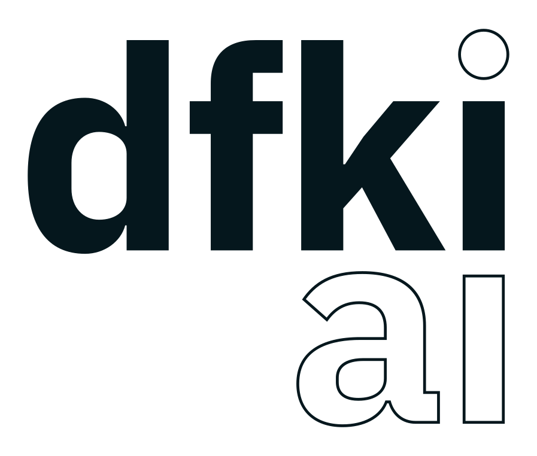
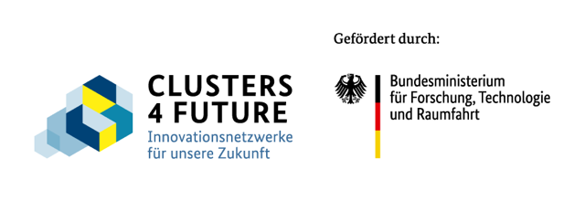
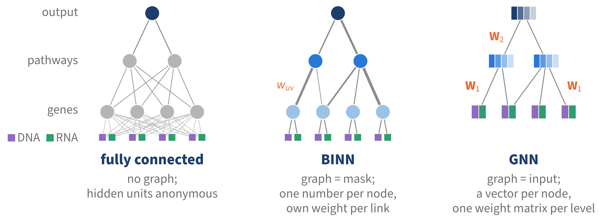
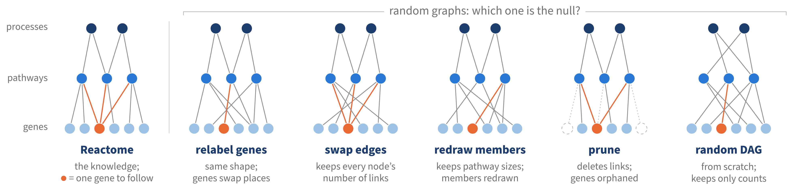

```{r setup, cache=FALSE}
library(binnr)
library(ggplot2)
library(dplyr, warn.conflicts = FALSE)
theme_set(theme_minimal(base_size = 20) +
            theme(panel.grid.minor = element_blank(), plot.background = element_blank()))
blue <- "#2a78d6"; grey <- "#7A7A7A"; orange <- "#eb6834"; dark <- "#1c3d6e"
nulls <- readRDS("data/null_paths.rds")
```

## Why prior knowledge?

:::: {.columns}
::: {.column width="34%"}
::: {.who}
{height="84px" fig-alt="DFKI logo"}

[German Research Center for Artificial Intelligence · Data Science and its Applications]{.cite}

{height="54px" fig-alt="curATime logo"}

[Cluster for Atherothrombosis and Individualised Medicine · Mainz]{.cite}

{height="96px" fig-alt="Clusters4Future, funded by the Federal Ministry of Research, Technology and Space"}
:::
:::
::: {.column width="66%"}
```{r pn-matrix, fig.width=8.4, fig.height=5}
set.seed(7)
n <- 18
blocks <- tibble(layer = c("DNA", "RNA", "proteins", "clinical"),
                 p = c(30, 30, 18, 9),
                 col = c("#8E6BBF", "#2E9E6E", "#E69F00", "#6E6E6E"))
blocks$x0 <- cumsum(c(0, head(blocks$p, -1) + 3))
blocks$cx <- blocks$x0 + blocks$p / 2 + 0.5
cells <- do.call(rbind, lapply(seq_len(nrow(blocks)), function(b) {
  d <- expand.grid(i = seq_len(n), j = seq_len(blocks$p[b]))
  d$x <- blocks$x0[b] + d$j; d$col <- blocks$col[b]
  d$v <- runif(nrow(d))
  if (blocks$layer[b] == "proteins") d$v[runif(nrow(d)) < 0.35] <- NA   # not quantified
  if (blocks$layer[b] == "RNA") d$v[d$i %in% c(3, 4, 11, 15)] <- NA       # layer missing
  d[!is.na(d$v), ]
}))
# little icons above each block
iy <- n + 5.8; tt <- seq(0, 3 * pi, length.out = 120)
helix <- function(cx) {
  x <- cx + (tt / (3 * pi) - 0.5) * 9
  list(rbind(data.frame(x = x, y = iy + 1.3 * sin(tt), g = 1), data.frame(x = x, y = iy - 1.3 * sin(tt), g = 2)),
       data.frame(x = x[seq(6, 120, 9)], y = iy + 1.3 * sin(tt[seq(6, 120, 9)]), yend = iy - 1.3 * sin(tt[seq(6, 120, 9)])))
}
strand <- function(cx) {
  x <- cx + (tt / (3 * pi) - 0.5) * 9; y <- iy + 0.5 + 0.9 * sin(tt); k <- seq(6, 120, 9)
  list(data.frame(x = x, y = y, g = 1), data.frame(x = x[k], y = y[k], yend = y[k] - 1.1))
}
fold <- function(cx) {
  u <- seq(0.4, 2 * pi + 0.1, length.out = 200)
  data.frame(x = cx + 2.4 * cos(u) + 0.8 * cos(4 * u), y = iy + 1.5 * sin(u) + 0.6 * sin(5 * u), g = 1)
}
d1 <- helix(blocks$cx[1]); d2 <- strand(blocks$cx[2]); d3 <- fold(blocks$cx[3])
body <- data.frame(x = blocks$cx[4] + 1.6 * cos(seq(0, pi, length.out = 40)),
                   y = iy - 1.6 + 1.6 * sin(seq(0, pi, length.out = 40)))
ggplot() +
  geom_tile(data = cells, aes(x, i, alpha = v), fill = cells$col, colour = "white", linewidth = 0.25) +
  scale_alpha(range = c(0.2, 1), guide = "none") +
  geom_path(data = d1[[1]], aes(x, y, group = g), colour = blocks$col[1], linewidth = 1.3) +
  geom_segment(data = d1[[2]], aes(x, y, xend = x, yend = yend), colour = blocks$col[1], linewidth = 0.8) +
  geom_path(data = d2[[1]], aes(x, y, group = g), colour = blocks$col[2], linewidth = 1.3) +
  geom_segment(data = d2[[2]], aes(x, y, xend = x, yend = yend), colour = blocks$col[2], linewidth = 0.8) +
  geom_path(data = d3, aes(x, y), colour = blocks$col[3], linewidth = 1.6, lineend = "round") +
  geom_polygon(data = body, aes(x, y), fill = blocks$col[4]) +
  annotate("point", x = blocks$cx[4], y = iy + 1.0, size = 5.5, colour = blocks$col[4]) +
  geom_text(data = blocks, aes(cx, n + 2, label = layer), colour = blocks$col,
            size = 5.6, fontface = "bold") +
  annotate("segment", x = -0.8, xend = -0.8, y = 0.5, yend = n + 0.5, colour = grey,
           arrow = arrow(ends = "both", length = unit(0.12, "inches"))) +
  annotate("text", x = -2.8, y = n / 2 + 0.5, label = "10^2-10^3~patients", parse = TRUE, angle = 90, size = 5.4, colour = grey) +
  annotate("segment", x = 0.5, xend = max(blocks$x0 + blocks$p) + 0.5, y = -0.8, yend = -0.8, colour = grey,
           arrow = arrow(ends = "both", length = unit(0.12, "inches"))) +
  annotate("text", x = max(blocks$x0 + blocks$p) / 2, y = -2.3, label = "10^3-10^4~features~per~layer", parse = TRUE, size = 5.4, colour = grey) +
  coord_fixed(clip = "off") + theme_void()
```
:::
::::

::: {.keywords}
**small** · **noisy** · **high-dimensional** · **multimodal**
:::

::: {.fragment .hook}
→ borrow strength from **prior knowledge**
:::

::: {.notes}
(Title, 0:15: "I'm going to talk about biologically informed neural networks:
what they promise, why the evidence is contested, and what we need to settle
it." Timings in brackets; total about 15 minutes.)

[0:45] We're at DFKI, the German Research Center for AI, in Sebastian
Vollmer's Data Science and its Applications department in Kaiserslautern.
Much of this work is for curATime, a Clusters4Future cluster here in Mainz
with TRON and the University Medical Center, on atherothrombosis, the
clot-forming process behind most heart attacks and strokes. Its second
implementation phase started this year.
The data we see there look like this: hundreds to a few thousand patients
with omics, thousands of features per measurement layer, noisy, with values
and whole layers missing. More features than patients means the data alone can't pin a model
down.
CLICK. So we want to bring in what biology already knows. Biologically
informed networks are one way to do that. Today's examples are cancer and
sepsis, because that's where the public benchmarks are; the cardiovascular
cohorts come next.
:::

## Wiring networks like biology

:::: {.columns}
::: {.column width="62%"}
```{r binn-diagram}
nodes <- tibble::tribble(
  ~id, ~x, ~y, ~label,
  "BRCA2", 0, 8, "BRCA2", "RAD51", 0, 7, "RAD51", "BRCA1", 0, 6, "BRCA1",
  "ATM", 0, 5, "ATM", "TP53", 0, 4, "TP53", "CHEK2", 0, 3, "CHEK2",
  "RB1", 0, 2, "RB1", "CCND1", 0, 1, "CCND1", "CDK4", 0, 0, "CDK4",
  "HDR", 1, 6.5, "homology-directed\nrepair", "CHK", 1, 4, "cell-cycle\ncheckpoints",
  "G1S", 1, 1, "G1/S\ntransition",
  "DNA", 2, 5.75, "DNA repair", "CC", 2, 2.25, "cell cycle",
  "out", 3, 4, "prediction")
member <- tibble::tribble(~from, ~to,
  "BRCA2", "HDR", "RAD51", "HDR", "BRCA1", "HDR", "ATM", "HDR",
  "BRCA1", "CHK", "ATM", "CHK", "TP53", "CHK", "CHEK2", "CHK",
  "RB1", "G1S", "CCND1", "G1S", "CDK4", "G1S",
  "HDR", "DNA", "CHK", "CC", "G1S", "CC", "DNA", "out", "CC", "out")
genes <- nodes$id[nodes$x == 0]; l1 <- nodes$id[nodes$x == 1]; l2 <- nodes$id[nodes$x == 2]
dense <- rbind(expand.grid(from = genes, to = l1), expand.grid(from = l1, to = l2),
               expand.grid(from = l2, to = "out"))
draw <- function(edges, named, highlight = NULL) {
  e <- merge(merge(edges, nodes[c("id", "x", "y")], by.x = "from", by.y = "id"),
             nodes[c("id", "x", "y")], by.x = "to", by.y = "id", suffixes = c("", "end"))
  e$hl <- e$from %in% highlight | e$to %in% highlight
  n <- nodes; n$hl <- n$id %in% highlight
  n$fill <- ifelse(n$x == 0, "#9cc3e6", ifelse(n$x == 3, "#1c3d6e", ifelse(n$hl, orange, blue)))
  p <- ggplot() +
    geom_segment(data = e, aes(x, y, xend = xend, yend = yend),
                 colour = ifelse(e$hl, orange, "grey65"), linewidth = ifelse(e$hl, 1.1, 0.5), alpha = 0.9) +
    geom_point(data = n, aes(x, y), shape = 21, size = 9, fill = n$fill, colour = "white", stroke = 1.2) +
    geom_text(data = n[n$x == 0, ], aes(x - 0.12, y, label = label), hjust = 1, size = 5.6, fontface = "italic") +
    annotate("text", x = 0, y = 9.1, label = "genes", size = 5.6, colour = "grey35") +
    annotate("text", x = 3, y = 5.1, label = "prediction", size = 5.6, colour = "grey35") +
    coord_cartesian(xlim = c(-0.75, 3.35), ylim = c(-0.5, 9.4), clip = "off") +
    theme_void()
  if (named) {
    p <- p + geom_label(data = n[n$x %in% 1:2, ], aes(x, y + 0.75, label = label), size = 4.8,
                        lineheight = 0.85, colour = ifelse(n$hl[n$x %in% 1:2], orange, dark), fontface = "bold",
                        fill = "white", label.size = 0, label.padding = unit(0.12, "lines"))
  } else {
    p <- p + annotate("text", x = 1.5, y = 9.1, label = "hidden units: no meaning", size = 5.6, colour = "grey35")
  }
  p
}
```

::: {.r-stack}
```{r diag-dense, fig.width=7.6, fig.height=5.6}
draw(dense, named = FALSE)
```

::: {.fragment fragment-index=1}
```{r diag-sparse, fig.width=7.6, fig.height=5.6}
draw(member, named = TRUE)
```
:::

::: {.fragment fragment-index=2}
```{r diag-hl, fig.width=7.6, fig.height=5.6}
draw(member, named = TRUE, highlight = "CHK")
```
:::
:::
:::
::: {.column width="38%"}
**inputs**, per patient and gene: mutated? copy number? activity?

::: {.fragment fragment-index=1}
::: {.defn}
**pathway**: genes whose products work together on one cellular job · curated (Reactome, GO) · nested
:::

**BINN** = keep only the connections the database supports
:::

::: {.fragment fragment-index=2}
→ **predict + explain**
:::

[P-NET (*Nature* 2021) · DCell (2018) · GenNet (2021) · BINN (2023)]{.cite}
:::
::::

::: {.notes}
[1:30] Start with an ordinary neural network. For each patient we feed in
measurements per gene (is it mutated, how many copies, how active) and the
network predicts an outcome. In between are hidden units, every input wired
to every unit; they work, but they mean nothing.
CLICK. A biologically informed network keeps only the connections that a
curated database supports. A pathway is a set of genes whose products work
together on one job: repairing broken DNA, or deciding when a cell divides.
These are real Reactome memberships. Pathways nest into broader processes.
Now every hidden unit has a name. Note what the arrows mean: "is part of",
a filing system, not signals travelling from gene to pathway.
CLICK. So after training we can ask which named units the prediction relied
on, here the cell-cycle checkpoints. That is the promise: predict and
explain. A unit's value is a learned score for the pathway, not a measured
pathway activity.
P-NET in Nature 2021 separated primary from metastatic prostate cancer this
way and pointed to MDM4 and FGFR1; DCell predicted yeast growth from gene
disruptions using the Gene Ontology.
(Diagram simplified: homology-directed repair sits under DNA repair via
"double-strand break repair"; G1/S under cell cycle via "mitotic cell cycle".)
:::

## A crowded field

:::: {.columns}
::: {.column width="38%"}
::: {.bignum}
86
:::
papers, 2018–2024

[Selby et al., *Front. AI* 2025]{.cite}

::: {.fragment}
- no shared **terminology**
- no shared **tools**
- no shared **benchmarks**
:::
:::
::: {.column width="62%"}
```{r papers-per-year, fig.width=7.2, fig.height=4.8}
years <- tibble(year = 2018:2024, n = c(3, 8, 6, 16, 8, 16, 21))
ggplot(years, aes(factor(year), n)) +
  geom_col(fill = blue, width = 0.7) +
  geom_text(aes(label = n), vjust = -0.4, size = 6, colour = dark) +
  labs(x = NULL, y = "works per year") +
  scale_y_continuous(expand = expansion(mult = c(0, 0.12))) +
  theme(panel.grid.major.x = element_blank())
```
[works listed in the review's Table A.1 (n = 78), by year]{.cite}
:::
::::

::: {.notes}
[0:45] Our systematic review last year found 86 papers in six years, mostly
cancer and drug response. Almost every one ships its own code, its own
preprocessing, its own evaluation, so nobody can easily compare them.
(Bar chart = the 78 works in the appendix table; the 86 also counts the
reviews and honourable mentions. If asked: same review, different counts.)
:::

## Under scrutiny

| question | study | finding |
|:--|:--|:--|
| **replicable?** | Pedersen et al. 2023 · *Cancer-Net* | P-NET reproduced; shuffled wiring **worse** |
| **stable?** | Esser-Skala & Fortelny 2023 | importance varies across retrainings, tracks network position |
| **does biology matter?** | Caranzano et al. 2026 · *"Sparsity is all you need"* | 20 models: random ≈ real |
| **what can it learn?** | Miller et al. 2026 · simulation | limited by *n*, signal, sparsity |
| **how many answers?** | Gankin et al. 2026 · 101 replicates | explanations correlate only ≈ 0.5 between reruns |

: {.scrutiny}

::: {.notes}
[1:15] And people have started checking. A reusability study rebuilt P-NET
and found that shuffling the wiring made it worse. Esser-Skala
and Fortelny retrained P-NET many times: the gene and pathway rankings move,
and they follow where a node sits in the network. Caranzano and colleagues
re-ran twenty pathway-informed models with random pathway assignments and
found random about as good as real; their title says sparsity is all you
need. Miller et al. simulated data and showed how sample size and signal limit
what P-NET can recover. And Gankin et al. trained 101 replicate models on UK
Biobank: explanations correlate only 0.5 between seeds at gene level.
Pedersen et al. is an arXiv preprint (2023).
:::

## Same model, opposite answers {.center}

:::: {.columns}
::: {.column width="50%"}
::: {.claimbox}
**P-NET, shuffled wiring**

AUPR ≈ 0.89 → ≈ 0.83

*biology matters*

[Pedersen et al. 2023]{.cite}
:::
:::
::: {.column width="50%"}
::: {.claimbox}
**P-NET, random wiring**

AUC 0.899 → 0.896

*sparsity is all you need*

[Caranzano et al. 2026]{.cite}
:::
:::
::::

::: {.fragment .hook}
Right **question**? Right **tool**?
:::

::: {.notes}
[0:45] Two careful groups, the same model, the same cohort, opposite
conclusions. That should worry us more than either result. Either they are asking subtly
different questions, or the tool they're using can't answer the question.
I'll argue it's both.
Note they even report different metrics (precision-recall vs ROC area):
part of the point, not a flaw in the slide.
(Pedersen values read from their Fig. 2 histograms, hence ≈; Caranzano Table 2.)
:::

## A BINN is message passing on a graph

{width="76%" fig-align="center" fig-alt="Three small networks on the same toy graph of DNA and RNA inputs, four genes, two pathways and an output. Fully connected: every unit wired to every other, units anonymous. BINN: only database links kept, one number per node, each link its own weight w_uv. GNN: the same links, each node holds a short vector; messages are averaged and one weight matrix per level (W1, W2) is shared by all links at that level."}

::: {.keywords}
$\big[(\mathbf{W}\odot\mathbf{M})\,\mathbf{h}\big]_v \;=\; \textstyle\sum_{u\to v} w_{uv}\, h_u$ · masked layer = one round of message passing
:::

::: {.fragment}
::: {.defn}
hidden nodes have no data → **defined by position alone**
:::

[`r round(100 * nulls$exch)`% of P-NET's genes: same pathways as another gene]{.cite}
:::

::: {.notes}
[1:30] Here's the lens. Three models on the same toy graph. On the left, an
ordinary network: everything wired to everything, hidden units anonymous.
In the middle, a BINN: keep only the database links. Each node holds one
number and each link has its own weight. Written as a matrix that's a mask
on the weights; written per node, it's one round of message passing on the
knowledge graph: each pathway sums weighted messages from its members.
Same function, different bookkeeping. On the right, a graph neural network
on the same graph: each node holds a short vector, incoming messages are
averaged, and one weight matrix per level is shared by every link at that
level. Because no weight belongs to a particular link, the graph is an input
you can swap rather than the architecture itself.
CLICK. The lens exposes something important: a pathway node has no data of
its own. The network only knows it by where it sits. On P-NET's own gene set,
about 60% of genes are annotated to exactly the same pathways as some other
gene, so the graph gives the network nothing to tell them apart; only
their data differ. So "real" and "random" graphs may be closer, functionally,
than they look.
:::

## What is the null hypothesis?

{width="100%" fig-alt="Six small node-link diagrams of genes, pathways and processes: the Reactome graph, then five random versions: gene labels permuted, edges swapped keeping each node's number of links, pathway members redrawn keeping pathway sizes, links pruned leaving orphaned genes, and a random DAG generated from scratch. One gene is coloured orange to follow across panels."}

::: {.hook}
H₀: *"the knowledge is irrelevant"* · but **which** random graph?
:::

::: {.fragment}
::: {.defn}
**straw-man null**: reject it, claim the favoured alternative
:::
[Gelman 2016, *J. Stat. Res.*]{.cite}
:::

::: {.notes}
[1:30] A real-versus-random comparison is a hypothesis test, so what is the
null hypothesis? "The knowledge is irrelevant" is not one hypothesis: there
are many ways to make a random graph. Here's the real graph in miniature:
genes at the bottom, pathways, broader processes; follow the orange gene.
Relabel the genes and the shape stays the same, but each gene lands in
someone else's place. Swap the ends of pairs of links and every node keeps
its number of connections. Redraw each pathway's members at random, keeping
its size. Prune links, and some genes are cut off entirely. Or generate a
random DAG from scratch. Each keeps something different, so each is a
different null hypothesis, and the published studies used different ones,
on top of different metrics and data splits. That alone could explain why
they disagree.
CLICK. And Gelman's warning applies in both directions: beating a straw-man
random graph is not evidence for the biology, and failing to beat it isn't
evidence against. The null should be chosen for the question, and stated.
:::

## Can't use it ≠ useless

:::: {.columns}
::: {.column width="58%"}
```{r planted, fig.width=7.4, fig.height=5}
pl <- tibble(
  signal = factor(c("sum of\ngenes", "sum within\npathways", "interaction"),
                  c("sum of\ngenes", "sum within\npathways", "interaction")),
  lo = c(0.79, 0.717, 0.45), hi = c(0.82, 0.761, 0.54),
  lasso = c(0.80, 0.746, 0.50), oracle = c(0.90, 0.881, 0.91))
ggplot(pl, aes(y = signal)) +
  geom_segment(aes(x = lo, xend = hi, yend = signal), linewidth = 7, colour = blue, alpha = 0.6) +
  geom_point(aes(x = lasso), shape = 18, size = 7, colour = dark) +
  geom_point(aes(x = oracle), shape = 17, size = 5, colour = orange) +
  annotate("text", x = 0.97, y = 3.35, label = "oracle (told true\npathway scores)", colour = orange, size = 4.6, hjust = 1, lineheight = 0.85) +
  annotate("text", x = 0.50, y = 3.35, label = "lasso", colour = dark, size = 5.5) +
  annotate("text", x = 0.66, y = 1.35, label = "BINNs: real + random graphs", colour = blue, size = 5.5) +
  scale_x_continuous(limits = c(0.42, 0.98)) +
  labs(x = "test AUROC, labels planted through Reactome", y = NULL)
```
[TCGA-PRAD RNA; Maani, Selby et al., in prep.]{.cite}
:::
::: {.column width="42%"}
- labels built **through** real pathways
- real ≈ random ≈ lasso ≪ oracle
- no power → **no conclusion**

::: {.fragment}
**ask instead**

- equivalence, not "*n.s.*"
- nested models: knowledge as a **penalty**
- positive controls
:::

[McShane, Gelman et al. 2019, *Am. Stat.*]{.cite}
:::
::::

::: {.notes}
[1:30] Second problem: power. We planted the answer. We generated labels on
real TCGA expression through real Reactome pathways, so the knowledge is
correct by construction. If the pathways only matter additively, everything
including the lasso does fine. If the signal pools genes within pathways,
which is the case BINNs are designed for, real graph, random graphs and lasso
are all the same and far below an oracle that is told the pathway scores.
Interactions: nobody learns them. So at TCGA sample sizes, "random equals
real" is what you see whether or not the knowledge is right. That's absence
of evidence. A statistician would ask differently: test equivalence within a
margin rather than read a non-significant difference; put the knowledge into
a nested model as a penalty or prior and ask whether it improves held-out
likelihood; and always run a positive control.
:::

## Every check is a new codebase

:::: {.columns}
::: {.column width="50%"}
**graph baked into code**

- new null → new model
- new database → new model
- new data type → new paper
:::
::: {.column width="50%"}
**ecosystem gap**

- BINNs: Python, one repo each
- R / Bioconductor: TCGA, `MultiAssayExperiment`, `limma`, `survival` … no BINNs
:::
::::

::: {.fragment .hook}
graph as **input** · checks as **one line**
:::

::: {.notes}
[0:45] None of these checks is exotic. They're hard because in every existing
implementation the graph is compiled into the model. A different null, a
different database, a covariate: each is a code change, often a new paper.
And these tools live in Python, while much of the biostatistics community and
its data infrastructure lives in R and Bioconductor. So we wrote the tool we
wanted.
:::

## binnr {.bigcode}

```{.r code-line-numbers="false"}
library(binnr)
brca <- tcga_cohort("BRCA")                     # curatedTCGAData, cached
g    <- reactome_graph()                        # igraph DAG; any gene sets work

fit  <- bn_fit(Surv(os_time, os_event) ~ age + stage, data = brca$clinical,
               omics = brca$omics, graph = g, arch = bn_arch("binn"))

update(fit, graph = bn_rewire(g, "degree"))     # null graphs: one argument
update(fit, arch  = bn_arch("gnn", hidden_dim = 4))
node_activations(fit, new_omics)                # patients × nodes
```

::: {.keywords}
`torch` · `igraph` · `MultiAssayExperiment` · formulas · tidy output · classification / regression / Cox
:::

::: {.notes}
[1:00] binnr. Three lines to get TCGA data, the Reactome graph and a fitted
model, here a survival model with clinical covariates. The graph is an igraph
object, so a null graph is one argument to update(). The architecture is
another: the same call gives a classic BINN or a graph neural network with
vector states and shared weights. Learned pathway scores come back as a patients
by pathways table, ready for limma or ggplot. Under the hood it's plain torch
for R; inputs can be a MultiAssayExperiment; outcomes can be classes, numbers
or survival times.
:::

## What it shows

```{r bench-fig, fig.width=12.5, fig.height=4.6}
bench <- readRDS(system.file("extdata", "benchmark.rds", package = "binnr"))
info <- attr(bench, "info"); k <- info$folds
head_ <- bench |> filter((task == "PAM50 subtype" & metric == "accuracy") |
                         (task == "Overall survival" & metric == "c_index") |
                         (task == "Gleason grade" & metric == "auroc"))
qv_summary <- function(d) {
  d <- d |> mutate(split = interaction(rep, fold, drop = TRUE), method = droplevels(factor(method)))
  fit <- lm(value ~ method + split, data = d)
  m <- nlevels(d$method); J <- nlevels(d$split)
  idx <- grep("^method", names(coef(fit)))
  Vfull <- matrix(0, m, m); Vfull[-1, -1] <- vcov(fit)[idx, idx]
  Vfull <- Vfull * (1 + J / (k - 1))
  qv <- qvcalc::qvcalc(Vfull, estimates = c(0, coef(fit)[idx]), labels = levels(d$method))$qvframe
  tibble(method = levels(d$method),
         mean = as.numeric(tapply(d$value, d$method, mean)[levels(d$method)]),
         qse = sqrt(qv$quasiVar)) |>
    mutate(lo = mean - 1.39 * qse, hi = mean + 1.39 * qse)
}
summ <- head_ |> group_by(task) |> group_modify(~ qv_summary(.x)) |> ungroup() |>
  mutate(method = sub(" of annotations", " annotations", method),
         family = ifelse(grepl("BINN|GNN", method), "binnr", "baseline"),
         task = factor(task, c("PAM50 subtype", "Overall survival", "Gleason grade"),
                       c("BRCA: PAM50 accuracy", "BRCA: survival C-index", "PRAD: Gleason AUROC")))
rk <- summ |> group_by(task) |> mutate(r = rank(-mean)) |> group_by(method) |> summarise(r = mean(r))
summ$method <- factor(summ$method, rev(rk$method[order(rk$r)]))
ggplot(summ, aes(mean, method, colour = family)) +
  geom_pointrange(aes(xmin = lo, xmax = hi), size = 0.6, linewidth = 0.9) +
  facet_wrap(~ task, scales = "free_x") +
  scale_colour_manual(values = c(baseline = grey, binnr = blue), name = NULL) +
  labs(x = "mean with quasi-variance comparison interval", y = NULL) +
  theme(legend.position = "none", strip.text = element_text(face = "bold"),
        axis.text.y = element_text(size = 14))
```

::: {.keywords}
real vs random graphs: **no detectable difference** · lasso matches or beats BINNs · age + stage hard to beat on survival
:::
[TCGA BRCA (n = 960) & PRAD (n = 491); `r info$repeats`×`r info$folds`-fold CV, tuned within folds. Also reproduces P-NET's split and Hartman et al.'s proteomics.]{.cite}

::: {.notes}
[1:15] One slide of results: two TCGA cohorts, three tasks, repeated
cross-validation, every model tuned inside the training folds. Blue are
binnr models, grey are baselines. Non-overlapping intervals mean a difference
at about the 5% level. Between Reactome and the rewired, random and
half-deleted graphs we see no difference we can detect; for the
classification tasks the paired intervals rule out differences much bigger
than about 0.03, and survival is too noisy to say more. Note I'm saying "no
detectable difference", not "the same". The lasso matches or beats every BINN,
and for survival, age and stage alone are as good as anything with omics. That's in line with the large multi-omics benchmarks. On
P-NET's own data split and on Hartman et al.'s proteomics, binnr reproduces
the published models, and the same pattern holds. The point is not a new
state of the art; it's that these comparisons are now cheap and honest.
(P-NET split: Reactome 0.92, nulls 0.91–0.94, lasso 0.94 AUROC; Hartman AKI:
binnr 0.997, Python binn 0.977, lasso 0.998.)
:::

## Next — and who wants in?

:::: {.columns}
::: {.column width="55%"}
**next**

- knowledge as **prior**, not mask
- hierarchy nulls · random DAGs
- missing modalities · covariates
- cardiovascular cohorts
- CRAN · Bioconductor

::: {.fragment .hook}
let's talk: **data · nulls · use cases**
:::
:::
::: {.column width="45%"}
```{r qr, fig.width=4, fig.height=4}
plot(qrcode::qr_code("https://github.com/datasciapps/binnr"))
```
[github.com/datasciapps/binnr]{.cite}

[david.selby@dfki.de]{.cite}
:::
::::

::: {.notes}
[1:00] Where next. Put the knowledge in as a prior rather than a hard mask,
so the data can tell us how much of it is used. Nulls that randomise the
hierarchy, and random DAGs from scratch. Missing data and covariates, which
matter most for cardiovascular disease, our application area. And CRAN and
Bioconductor. Most of all: if you have data, nulls you'd like tested, or a
use case, I'd like to hear from you. Thank you.
:::
